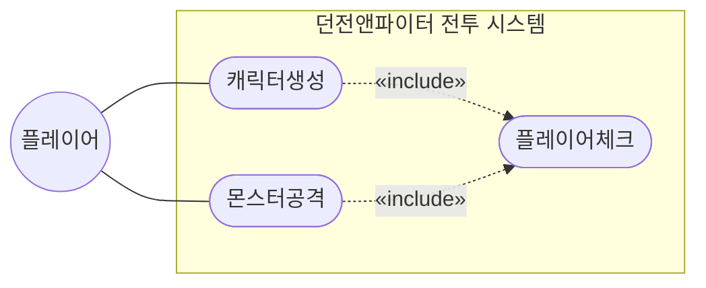

```mermaid
graph LR
    Player(("플레이어"))

    subgraph System["던전앤파이터 전투 시스템"]
        direction TB
        UC1(["캐릭터생성"])
        UC2(["몬스터공격"])
        UC3(["플레이어체크"])

        UC1 -. "«include»" .-> UC3
        UC2 -. "«include»" .-> UC3
    end

    Player --- UC1
    Player --- UC2
```
